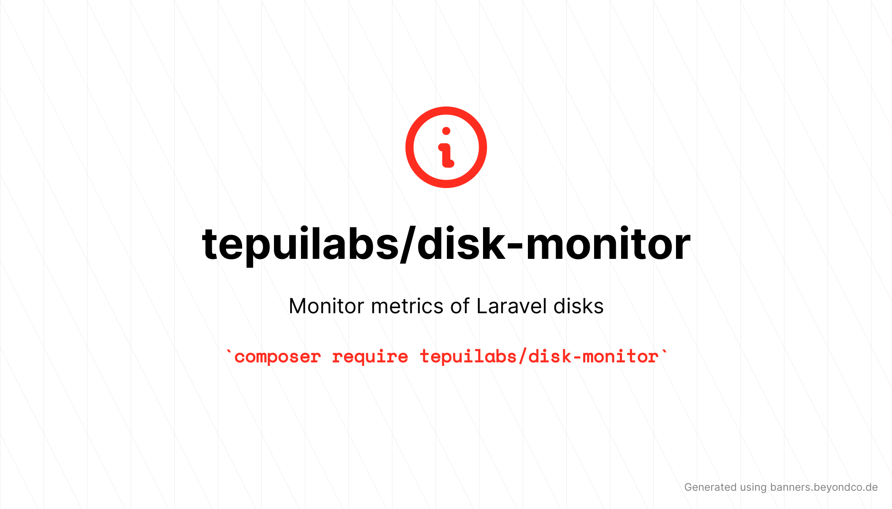

<p align="center">
	
</p>

# Monitor metrics of Laravel disks

[](https://packagist.org/packages/tepuilabs/disk-monitor)
[](https://github.com/tepuilabs/disk-monitor/actions?query=workflow%3Arun-tests+branch%3Amaster)
[](https://packagist.org/packages/tepuilabs/disk-monitor)


laravel-disk-monitor can monitor the usage of the filesystems configured in Laravel. Currently only the amount of files a disk contains is monitored.

## Installation

You can install the package via composer:

```bash
composer require tepuilabs/laravel-disk-monitor
```

You can publish and run the migrations with:

```bash
php artisan vendor:publish --provider="Tepuilabs\LaravelDiskMonitor\LaravelDiskMonitorServiceProvider" --tag="migrations"
php artisan migrate
```

You can publish the config file with:
```bash
php artisan vendor:publish --provider="Tepuilabs\LaravelDiskMonitor\LaravelDiskMonitorServiceProvider" --tag="config"
```

This is the contents of the published config file:

```php
return [
];
```

## Usage

``` php
$laravel-disk-monitor = new Tepuilabs\LaravelDiskMonitor();
echo $laravel-disk-monitor->echoPhrase('Hello, Tepuilabs!');
```

## Testing

``` bash
composer test
```

## Changelog

Please see [CHANGELOG](CHANGELOG.md) for more information on what has changed recently.

## Contributing

Please see [CONTRIBUTING](.github/CONTRIBUTING.md) for details.

## Security Vulnerabilities

Please review [our security policy](../../security/policy) on how to report security vulnerabilities.

## Credits

- [angel cruz](https://github.com/abr4xas)
- [All Contributors](../../contributors)

## License

The MIT License (MIT). Please see [License File](LICENSE.md) for more information.
